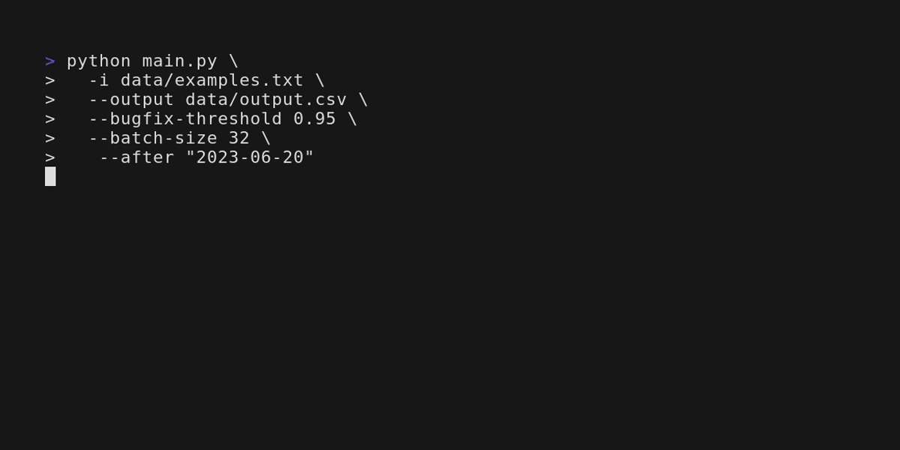

# commit-bugfix-classifier
`commit-bugfix-classifier` is a tool that clones remote Git repositories, extracts commit information, and classifies commits using euralSentry's [bugfix classification model](https://huggingface.co/neuralsentry/starencoder-git-commit-bugfix-classification).

## Installation
*Python 3.11+ and pip is required*
```bash
# Optional (venv)
python3 -m venv venv
source venv/bin/activate

# Install Pytorch
# See: https://pytorch.org/get-started/locally/
# For systems with NVIDIA GPUs:
pip3 install torch --index-url https://download.pytorch.org/whl/cu118

# For systems without NVIDIA GPUs:
pip3 install torch --index-url https://download.pytorch.org/whl/cpu

# Install dependencies
pip install -r requirements.txt
```
## Usage
### Built-in Help
```bash
python main.py --help
```
### Example
**Windows**
```ps1
python main.py `
  -i data/examples.txt `
  --output data/output.csv `
  --bugfix-threshold 0.95 `
  --batch-size 32 `
  --after "2023-01-01"
```

**Linux**
```bash
python main.py \
  -i data/examples.txt \
  --output data/output.csv \
  --bugfix-threshold 0.95 \
  --batch-size 32 \
  --after "2023-01-01"
```
